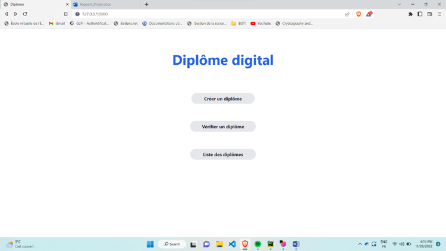
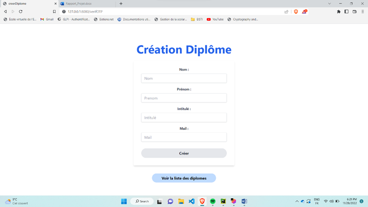
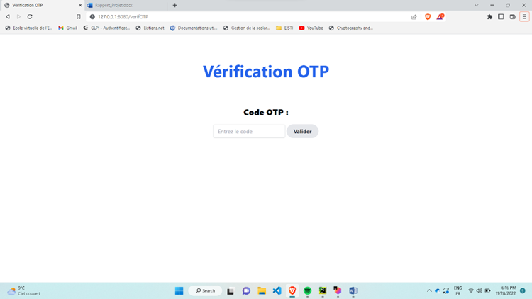
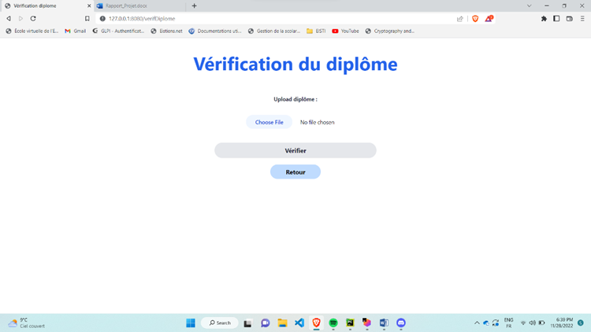
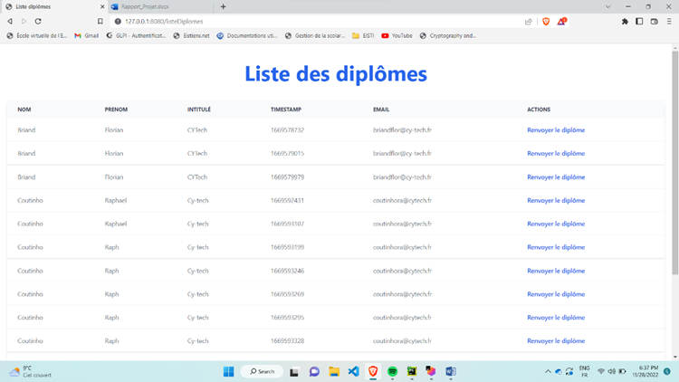

# Structure du projet

Vidéo de présentation : Video Démo Projet.mp4

Pour **lancer le projet**, il faut lancer le fichier **ApplicationWeb.py**

Les autres fichiers importants sont :

- **creerDiplome.py** détaille toutes les étapes de création de nos diplômes
- **verifierDiplome.py** détaille toutes les étapes de vérification de nos diplômes
- **mail.py** détaille toutes les étapes d'envoi de mail

Dans le dossier "diplome" se trouve :

- la base de données des diplomes (diplomeCree/diplomes.txt)
- les fichiers temporaires liés aux diplomes
- le template PNG

Dans le dossier "gestionCertificat" se trouve :

- le script pour générer la private key, le certificat, la signature ainsi que vérifier la validité du diplôme (creation_root_ca.py)
- le certificat de certification de CY Tech (ca.pem)
- la public key (public.pem)
- la configuration de l'autorité de certification de CYTech que l'on a défini (root-ca-cert.conf)
- un dossier contenant la private key (private.pem)

Dans le dossier "outils" se trouve :

- le script pour générer les codes OTP (GoogleAuthenticator.py)
- le script pour sécuriser les cookies de connexion aléatoires (secureCookie.py)
- la bdd pour les cookies de connexion en cours (tokenSession.txt)
- le script pour reveler/cacher des messages par stéganographie d'une image (stegano.py)
- le script pour écrire proprement dans un fichier (writeFile.py)

Dans le dossier "rwqrcode" se trouve :

- le script pour générer des QR codes (createQRcode.py)
- le script pour lire des QR codes (detectQRcode.py)

Dans le dossier "templates" se trouve :

- la page HTML pour créer diplôme via un formulaire (creerDiplome.html)
- la page HTML pour afficher les diplômes déjà créés (diplomesCrees.html)
- la page HTML pour vérifier un OTP (otp.html)
- la page HTML pour vérifier un diplôme (verifDiplome.html)

Rapport de projet : Diplôme digital
===============================
Réalisé par : [Raphael Coutinho, Florian Briand]
Date : [28/11/2022]

GitHub : https://github.com/FlorianBriand/Projet_Diplome

# Introduction

Notre projet est de créer une application qui permet à une école, dans le cas précis CY Tech, de diffuser
électroniquement et de manière sécurisée une attestation de réussite.
Dans ce rapport, nous allons décrire les différentes étapes de notre projet, les choix techniques que nous avons fait et
les solutions apportées.

# Projet

Nous avons choisi de créer une application web, comme IHM. Nous avons utilisé le Framework Flask pour sa réalisation,
couplé avec Tailwind CSS pour le design. Pour la partie logique, nous avons utilisé le langage Python.
Tout d’abord, nous sommes passés par une phase d'initialisation.
Dans laquelle, nous avons créé une autorité de certification correspondant à l'école CY Tech.
Ce qui nous a permis de créer une clé privée, une clé publique et un certificat pour l'école CY Tech.
Cela nous a permet de signer et de vérifier des documents.
Nous nous sommes basés sur la boite à outils OpenSSL pour cette phase.

Notre projet est divisé en 3 fonctionnalités principales :

- Création d'un diplôme
- Vérification d'un diplôme
- Gestion des diplômes

Image page d’accueil

## La fonctionnalité : Création d'un diplôme

Cette fonctionnalité permet à une entité comme CY Tech de créer un diplôme pour un étudiant.
Ultérieurement, l'authenticité du diplôme pourra être vérifié.
Dans la pratique, l'étudiant recevra un email avec son diplôme en pièce jointe, sous la forme d'un fichier PNG.

Tout d'abord, on rentre les informations (nom, prénom, nom du diplôme) de l'élève à qui on souhaite délivrer un diplôme,
via un formulaire dédié.
Ces informations sont ensuite utilisées afin de créer le diplôme.

Image d’un formulaire

La création se réalise en 5 étapes.

### 1ère étape : Intégration par stéganographie des informations de l'étudiant dans l'image.

Pour transmettre une information de manière sécurisée, nous avons choisi d'utiliser la stéganographie.
Ici, nous avons utilisé la stéganographie afin de cacher les informations de l'étudiant dans une image.
Dans notre cas, nous avons choisi d'utiliser une image représentant un diplôme et d'y intégrer les informations de
l'étudiant.
Cette image PNG sera l'image que l'étudiant recevra par email comme diplôme officiel de CY Tech.

### 2eme étape : Signature des informations de l'étudiant

Dans cette étape, nous avons signé les informations de l'étudiant avec la clé privée de CY Tech.
Celle-ci est créée lors de la phase d'initialisation.
Cette étape est d'assurer que CY Tech à bien certifier les informations de l'étudiant.

### 3ème étape : Création du QR code

Dans cette étape, on récupère la signature faite à l'étape 2 et on le stocke dans le QR code.

### 4ème étape : Intégration du QR code dans l'image

On récupère l'image contenant le message cacher en stéganographie.
Puis, on y insère le QR code composé de la signature des informations de l'étudiant.

### 5ème étape : Envoi du diplôme par email

Cette dernière étape consiste à envoyer le diplôme à l'étudiant par un email sécurisé.
Pour cela, nous avons utilisé le protocole SMIME de OpenSSL.
Le mail contient le diplôme en pièce jointe, sous la forme d'un fichier PNG.

### Mesures de sécurité de cette fonctionnalité

Pour s'assurer que la personne qui crée le diplôme est bien CY Tech, nous avons implémenté une authentification par OTP.
Il s’agit d’un code à 6 chiffres qui se régénère à intervalle régulier. On a utilisé le model de GoogleAuthentificator,
pour générer ce code.
Sans le bon code OTP, il est impossible de créer un diplôme. Si l’on rentre le bon, on donne à l’utilisateur, un token
de session aléatoirement générer qui lui donnera par la suite l’autorisation de créer des diplômes.

Image vérification OTP

## La fonctionnalité : Vérification d'un diplôme

L’utilisateur upload le diplôme qu’il a reçu par mail dans l’application Web.
La vérification se réalise en 3 étapes.

### 1ère étape : Récupérer le message caché en stéganographie

On récupère les informations de l’étudiant cachées en stéganographie lors de la création du diplôme.

### 2ème étape : Lecture du QR code

Lors de cette étape, nous avons récupéré la signature stockée dans le QR code.

### 3ème étape : Vérification de l’authenticité

Durant cette dernière étape, on vérifie que la signature, récupéré à l’étape 2, correspond aux informations de
l’étudiant récupéré en stéganographie à l’étape 1.
Si les deux informations correspondent, le diplôme est validé.
Pour faire cette vérification, on utilise OpenSSL. Dans la pratique, OpenSSL vérifie l’empreinte du message avec les
informations de l’étudiant et la signature du QR code.

Image de la page vérification

## La fonctionnalité : Gestion des diplômes

Cette fonctionnalité permet de visualiser la liste des diplômes créés par l'entité CY Tech.
Également, elle permet de renvoyer à tout moment un diplôme déjà créer à un étudiant.

Image de la liste des diplômes

# Conclusion

Ce projet nous a permis de mettre en pratique les notions théoriques que nous avons vu en cours.
Nous avons pu mettre en place des mesures de sécurité afin de garantir l'authenticité des diplômes.
Nous avons également pu mettre en place une architecture de type client-serveur.
Cela nous a permis de mettre en place une application Web qui permet de créer, vérifier et gérer des diplômes.
